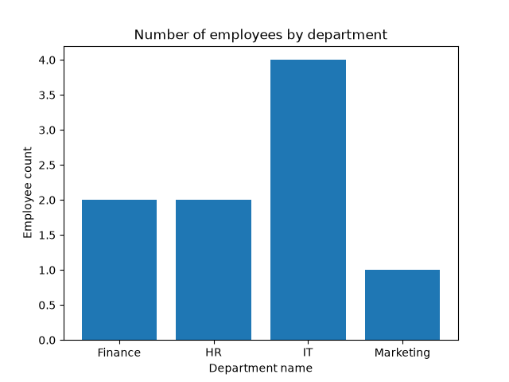
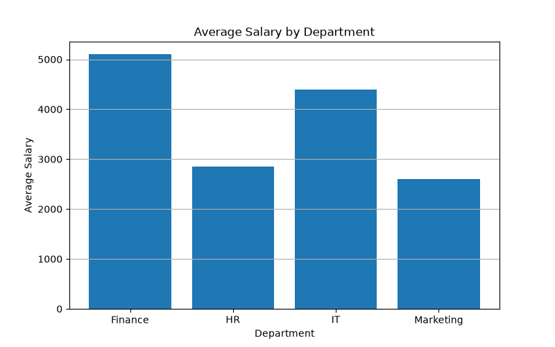
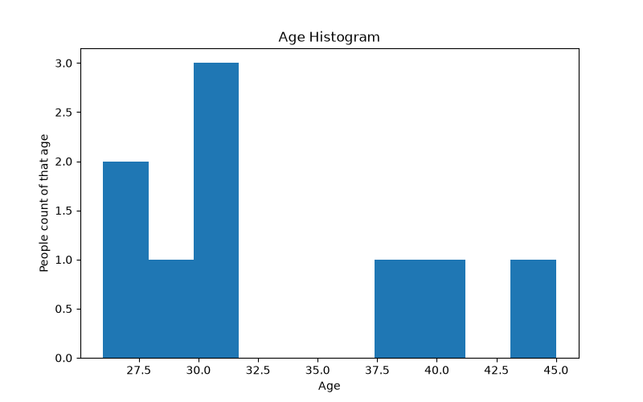
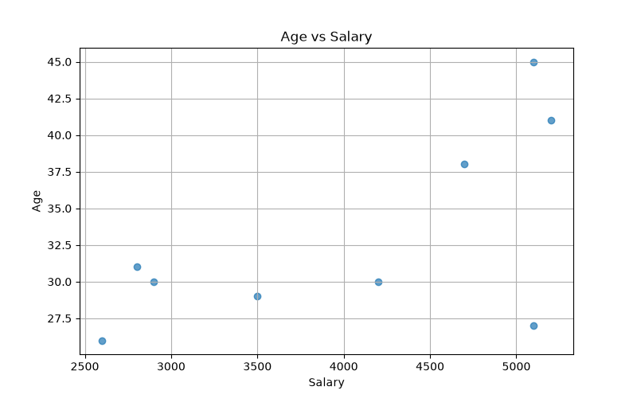
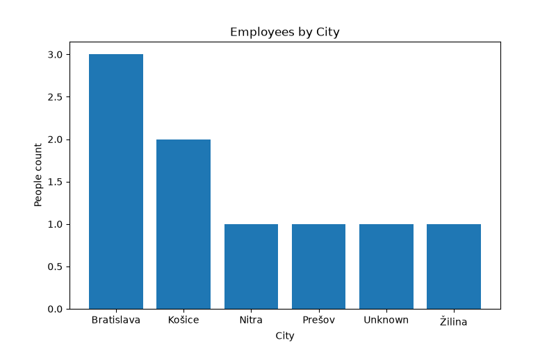

# 04 - Data Visualization

This project explores employee data using Python, Pandas and Matplotlib.

The goal was to visualize employee distribution, salary information and relationships between variables.

## Visualizations

### Employees by Department

### Average Salary by Department

### Age Distribution

### Salary vs Age

### Employees by City

