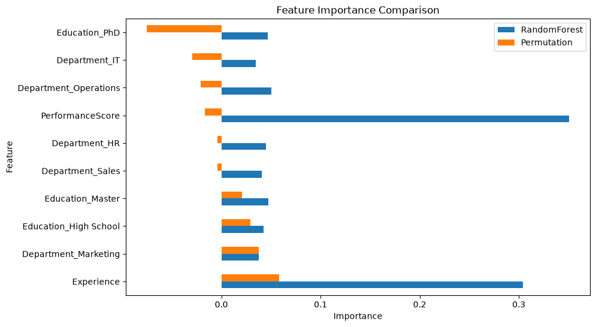

# 15 - Feature Importance Analysis with Random Forest

This project analyzes feature importance in a Random Forest classifier and compares two different approaches:

- Random Forest Feature Importance
- Permutation Importance

The model predicts whether an employee belongs to the high salary group.

The model uses:

- Experience
- PerformanceScore
- Education
- Department

## Feature Importance Methods

Two approaches were compared:

**Random Forest Feature Importance**

Measures how much each feature contributes to reducing impurity during tree construction.

**Permutation Importance**

Measures how much model performance changes when individual features are randomly shuffled.

This provides a better understanding of which features actually contribute to prediction performance.

## Results

The comparison between both methods:

Random Forest Feature Importance showed that Experience and PerformanceScore were among the most important features used by the model.

However, Permutation Importance showed a more conservative result, with only a few features providing a positive impact on model performance.

## Conclusion

The results showed that features frequently used inside the Random Forest model do not always have a strong predictive contribution.

Permutation Importance suggested that the dataset contains only weak predictive signals for salary classification, which is consistent with previous experiments.

Feature importance analysis helped to better understand model behavior beyond accuracy alone.