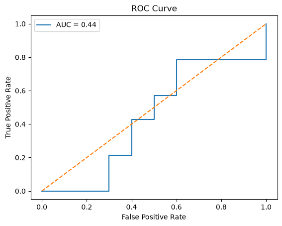

# 16 - ROC Curve and AUC Evaluation

This project evaluates a Logistic Regression classifier using ROC Curve and AUC score to measure how well the model can distinguish between high and low salary groups.

The model uses:

- Experience
- PerformanceScore
- Education
- Department

## ROC Curve

ROC Curve was used to evaluate model performance across different classification thresholds.

Instead of using only one decision threshold (0.5), ROC evaluates how the model behaves when the threshold changes.

The diagonal line represents a random classifier baseline (AUC = 0.5).

## Results

Performance:

| Metric | Score |
|---|---:|
| ROC AUC | 43.6% |

ROC Curve visualization:

## Conclusion

The Logistic Regression model achieved an AUC score below the random baseline, which indicates weak separation between high and low salary groups.

The results confirm previous experiments showing that the dataset contains limited predictive information for salary classification.

The step-like shape of the ROC curve was caused by the small test dataset size.