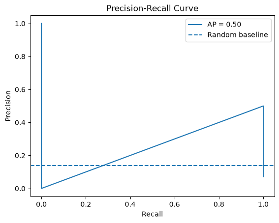

# 19 - Precision-Recall Curve

This project demonstrates how Precision-Recall analysis can be used to evaluate classification models, especially when working with imbalanced datasets.

The model uses:

- Experience
- PerformanceScore
- Education
- Department

## Precision-Recall Evaluation

A Logistic Regression model with `class_weight="balanced"` was trained on an imbalanced dataset.

The model probabilities were evaluated using:

- Precision-Recall Curve
- Average Precision Score

## Results

Average Precision:

| Metric | Score |
|---|---:|
| Average Precision | 50% |

The Precision-Recall curve shows the relationship between:

- Precision - correctness of positive predictions
- Recall - ability to find actual positive cases

## Visualization

## Conclusion

Precision-Recall analysis is especially useful for imbalanced classification problems where accuracy alone can be misleading.

The experiment showed the trade-off between detecting more positive cases and increasing the number of false positive predictions.

Due to the small dataset size and limited number of minority class examples, the curve contains only a small number of threshold points and should be interpreted carefully.